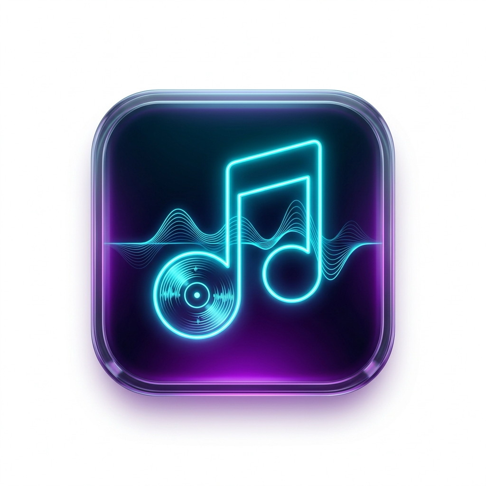

<div align="center">
  

  # Songleton

  **A focused, native macOS menu bar companion for the music you already use.**

  [](https://www.apple.com/macos/)
  [](https://www.swift.org/)
  [](https://developer.apple.com/xcode/swiftui/)
  [](Makefile)
  [](LICENSE)
</div>

Songleton puts playback status and useful controls one hover away, without replacing Spotify or Apple Music. It is intentionally small, native and keyboard-friendly.

## Download and Install

1. Open the [latest release](../../releases/latest).
2. Download `Songleton-1.0.dmg`.
3. Open the disk image and drag Songleton to Applications.
4. Launch Songleton and complete the Automation permission setup.
5. Open Settings to choose System, English or Turkish. Language changes apply immediately.

The first launch may ask for Automation access to Spotify and Apple Music. Songleton needs this permission because macOS protects Apple Events by default.

## What You Get

### Native Menu Bar Player

- Live track title, artist and album artwork.
- Play, pause, previous and next controls.
- Click-to-copy track information in `Artist - Track` format.
- Marquee text for long titles with a compact sleeping state when no player is available.
- Configurable menu bar width, font and artist visibility.

### Hover Control Panel

- Album artwork with a subtle breathing animation while playing.
- Progress and seek controls where the player exposes duration.
- Volume control for the active source.
- Shuffle and repeat controls for Spotify and Apple Music.
- Dynamic accent colors based on the active source or artwork.
- Lyrics accordion with synchronized scrolling and manual timing offset.

### Supported Sources

- Spotify desktop application.
- Apple Music desktop application.


### History and Playlists

- Keep the last 20 detected tracks in the local history view.
- Copy any history entry instantly.
- Save Spotify playlist links or URIs locally and launch them from the playlist view.

## Privacy and Security

- No analytics, tracking or user account is required.
- Playback commands and media state are handled locally through macOS Automation.
- User preferences and saved playlists are stored in local `UserDefaults`.
- Lyrics lookup is the only optional network feature. Track, artist, album and duration metadata may be sent to [LRCLIB](https://lrclib.net/) to find synchronized lyrics.
- No audio, authentication token or playlist content is uploaded by Songleton.
- Release builds use the hardened runtime and do not include the debugger entitlement.

## Build from Source

### Requirements

- macOS 14.0 or newer.
- Xcode 15 or newer.
- Spotify or Apple Music for desktop playback controls.

### Commands

```bash
git clone <repository-url>
cd Songleton

# Build and launch the debug app
make run

# Run the native test runner
make test

# Run tests and print the LLVM coverage report for core code
make coverage

# Build and verify a release app
make build-release

# Build a DMG
make dmg

# Submit a DMG for notarization
make notarize APPLE_ID=you@example.com TEAM_ID=XXXXXXXXXX APP_PASSWORD=xxxx-xxxx-xxxx-xxxx
```

The release target uses a distribution-safe entitlement set. Notarization requires your own Apple Developer credentials and is intentionally not attempted by the regular `dmg` target.

## Technology

- Swift 5 and SwiftUI.
- AppKit `NSStatusItem` and `NSPopover` for menu bar lifecycle.
- Apple Events and AppleScript for Spotify and Apple Music control.
- Swift concurrency with a serialized media command queue.
- LRCLIB synchronized lyrics API with cancellation-safe track loading.
- String Catalog localization with System, English and Turkish modes.
- Hardened runtime code signing for release builds.

## Project Layout

```text
Songleton/
├── App/          App lifecycle, menu bar and toast managers
├── Controllers/  Media application controllers
├── Models/       Playback state, settings, playlists and localization
├── Services/     Lyrics networking and parsing
├── Views/        Menu bar, player, settings, lyrics and playlist UI
└── Assets.xcassets

SongletonTests/
├── Controllers/  Controller parsing and automation helpers
├── Models/       Model and persistence tests
├── Services/     Lyrics parsing and networking tests
└── Support/      Assertions and test infrastructure
```

## License

Songleton is distributed under the MIT License. See [LICENSE](LICENSE).
